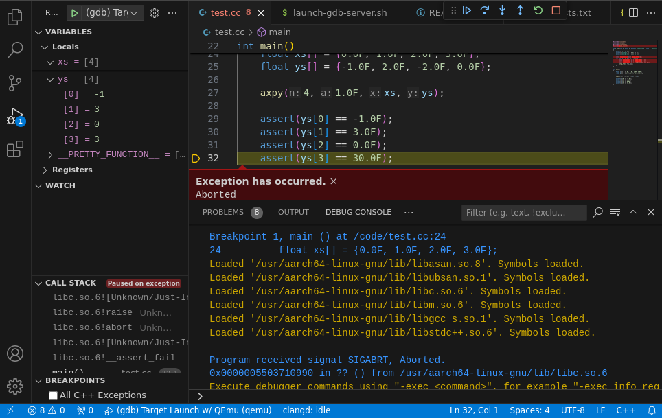
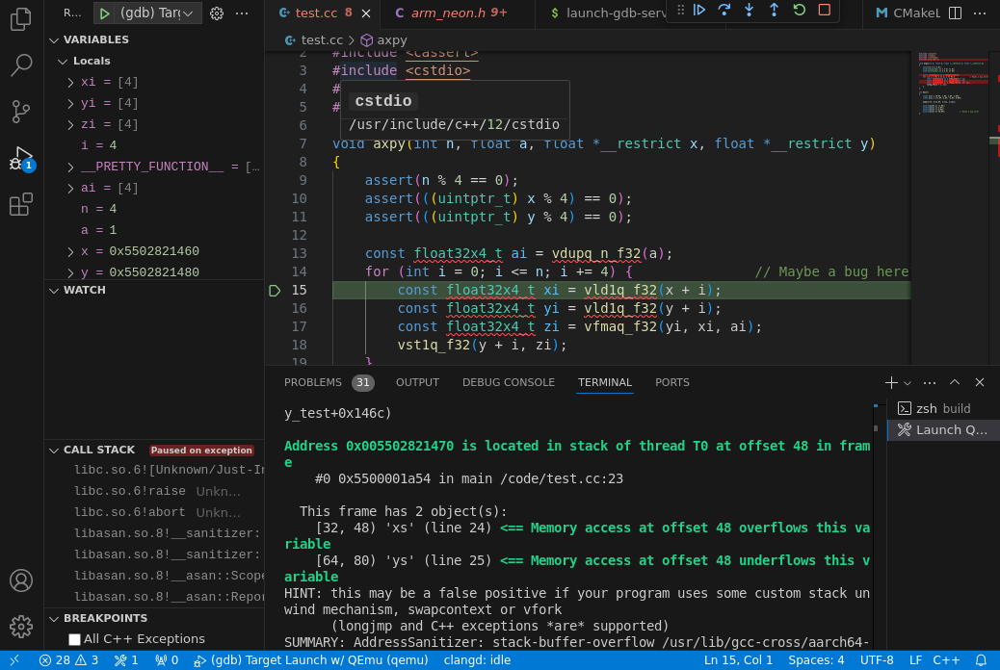

# Aarch64 (or other) Testbench for x86 Hosts



This is a small example project that shows you how to test and debug a cross-compiled application on x86.
It relies on the great [QEmu](https://www.qemu.org/), [gdb](https://sourceware.org/gdb/) and [VSCode](https://visualstudio.microsoft.com/).

As demonstration, it also includes debugging with [Sanitizers](https://github.com/google/sanitizers):



## Setup

Install packages (Debian, Ubuntu): `qemu-aarch64 gdb-multiarch gcc-aarch64-linux-gnu g++-aarch64-linux-gnu`

## Build

```sh
mkdir build && cd build
cmake ..
make
ctest     # Transparently runs the test with QEmu
```

CMake is configured to use a cross-compiler by default. In your own project, you might prefer a setup via [toolchain files](https://cmake.org/cmake/help/latest/manual/cmake-toolchains.7.html).

The execution of the test program is wrapped in QEmu in `CMakeLists.txt`, so that `ctest` just does the right thing.
One notable thing you have to disable when building with sanitizers is the Leak Sanitizer. It does not work in this setup. This can be done with `ASAN_OPTIONS=detect_leaks=0`.


## Debug

In VSCode, switch to the debugging view and hit "Run". A dialog box will show up that tells you that the QEmu task is not exiting, this is fine. Check the checkbox and hit "Debug Anyway". Enjoy!


## FAQ

- Q: Why?

    A: Developing on a workstation is convenient. Longer answer: Some embedded Linux targets might not be fully-fledged development environments with a debugger, etc. Additionally, copying all required files (binary, all the source code) to the device can be a hassle.
    If you cross-compile, why not also cross-test and cross-debug? :)

- Q: But you could just do an x86 build?

    A: Sometimes that is not easily possible, e.g., when you rely on the ISA by using intrinsics. Yes, you could also provide non-intrinsics code in an #ifdef. But then, you don't test the actual program anymore, right?!

- Q: Can this be extended to other architectures besides Aarch64?

    A: Yes, if QEmu and gdb-multiarch support the architecture.

- Q: Can I use this in my project?

    A: Yes, absolutely.
